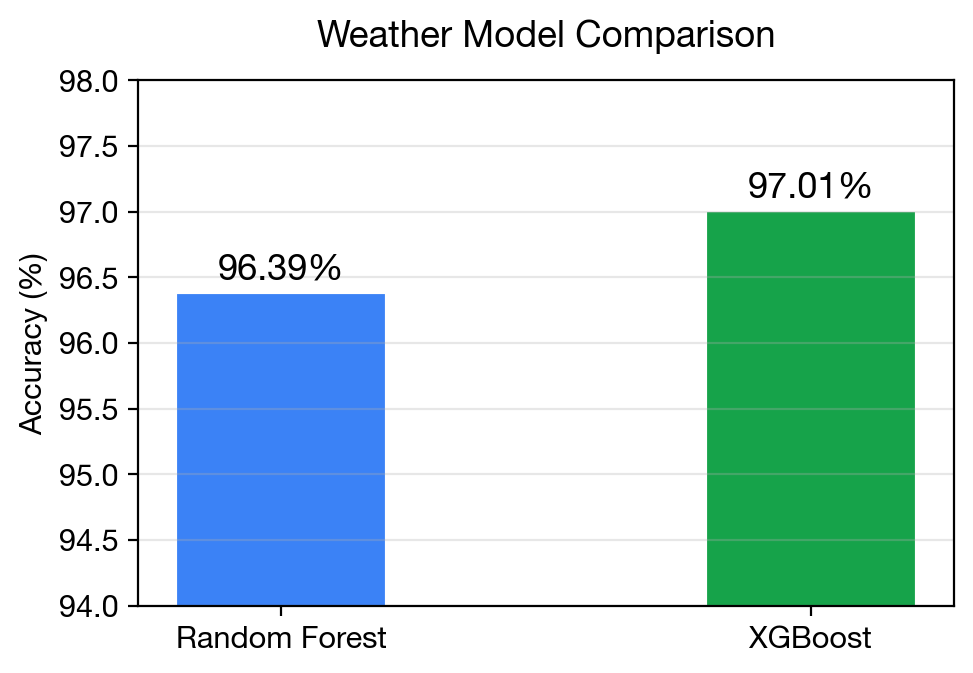
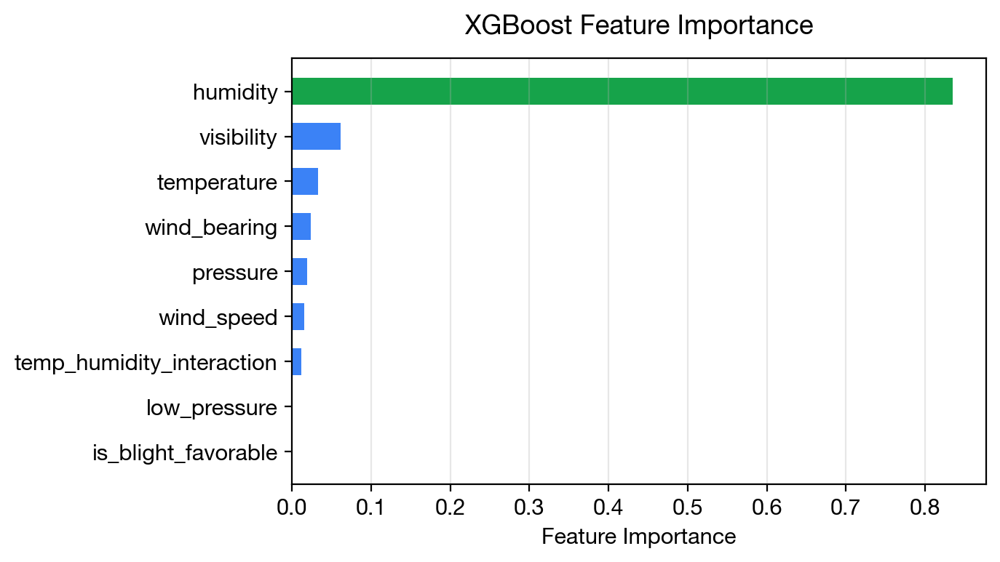
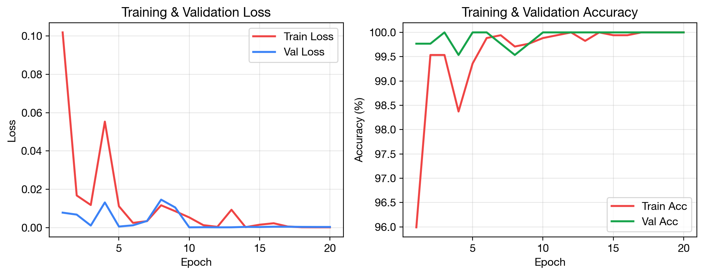
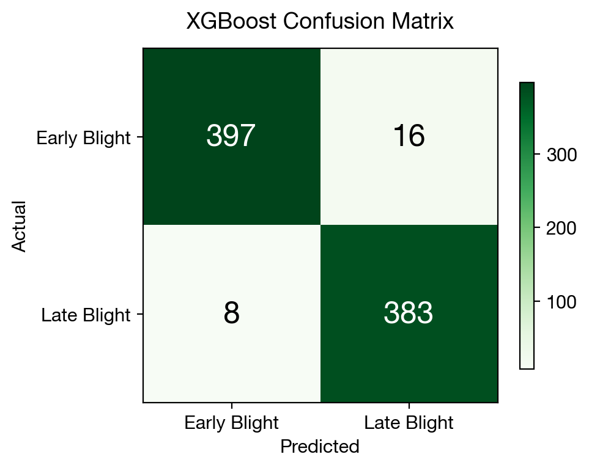
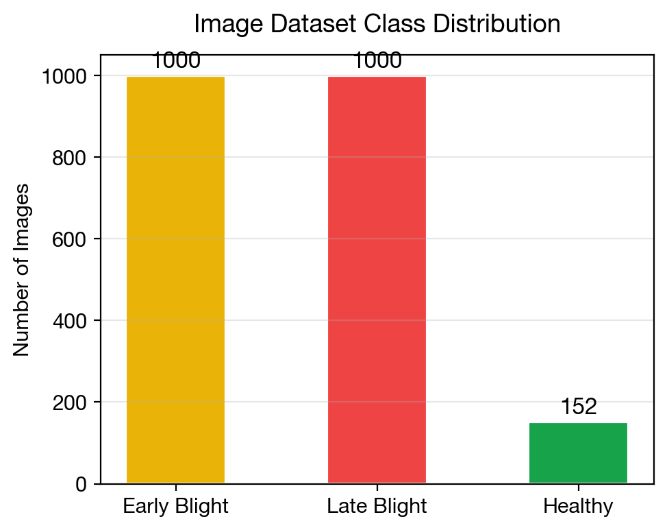

# Potato Disease Predictor

This project is a comprehensive solution for predicting potato diseases using machine learning and computer vision techniques. It includes models for both weather-based and image-based predictions.

## Features

- **Weather-based Prediction**: Predicts potato blight based on weather conditions using machine learning models.
- **Image-based Prediction**: Uses Vision Transformers (ViT) to classify potato leaf images into healthy, early blight, or late blight.
- **Streamlit Dashboard**: Interactive web interface for easy model interaction.

## Project Structure

```
PotatoDiseasePredictor/
├── app.py                          # Main Streamlit application
├── app_combined.py                 # Combined weather and image prediction app
├── potato_blight_prediction.py     # Weather-based prediction script
├── potato_blight_demo.py           # Demo script for weather prediction
├── predict_image.py                # Image prediction script
├── potato_disease_predictor/       # Packaged application
├── scripts/                        # Data processing and training scripts
├── report_figures/                 # Visualizations and analysis figures
├── sample_test_images/             # Sample images for testing
└── README.md                       # This file
```

## Installation

### Prerequisites

- Python 3.8+
- pip

### Setup

1. Clone the repository:

```bash
git clone https://github.com/shreyamishra1602/PotatoDiseasePredictor
cd PotatoDiseasePredictor
```

2. Install dependencies:

```bash
pip install -r requirements.txt
```

## Usage

### Running the Application

To start the Streamlit dashboard:

```bash
streamlit run app.py
```

### Running Prediction Scripts

For weather-based prediction:

```bash
python potato_blight_prediction.py
```

For image-based prediction:

```bash
python predict_image.py --image_path path_to_image.jpg
```

## Model Training

The project includes scripts for training both weather-based and image-based models:

1. **Weather Model Training**:

```bash
cd scripts
python 3_train_weather_model.py
```

2. **Vision Transformer Training**:

```bash
cd scripts
python 5_train_vit_model.py
```

## Results

### Model Performance



### Feature Importance



### Training History



### Confusion Matrix



### Class Distribution



## Contributing

Contributions are welcome! Please open an issue or submit a pull request for any improvements or bug fixes.

## License

This project is licensed under the MIT License.

## Acknowledgments

- Dataset providers
- Open-source contributors
- Machine learning and computer vision communities
